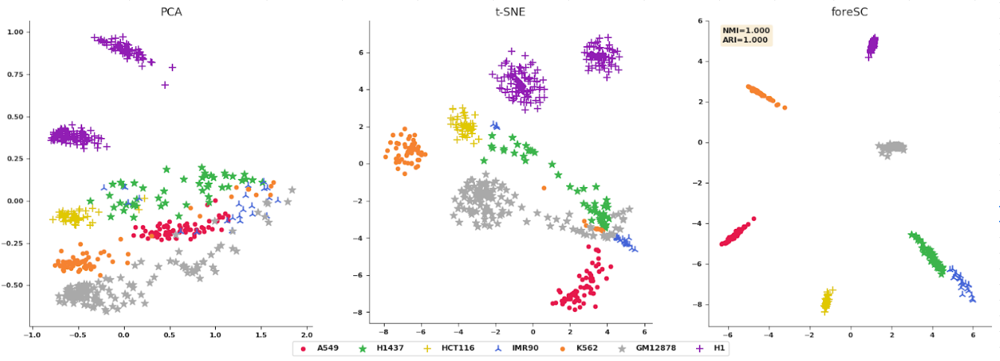
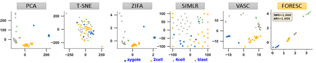
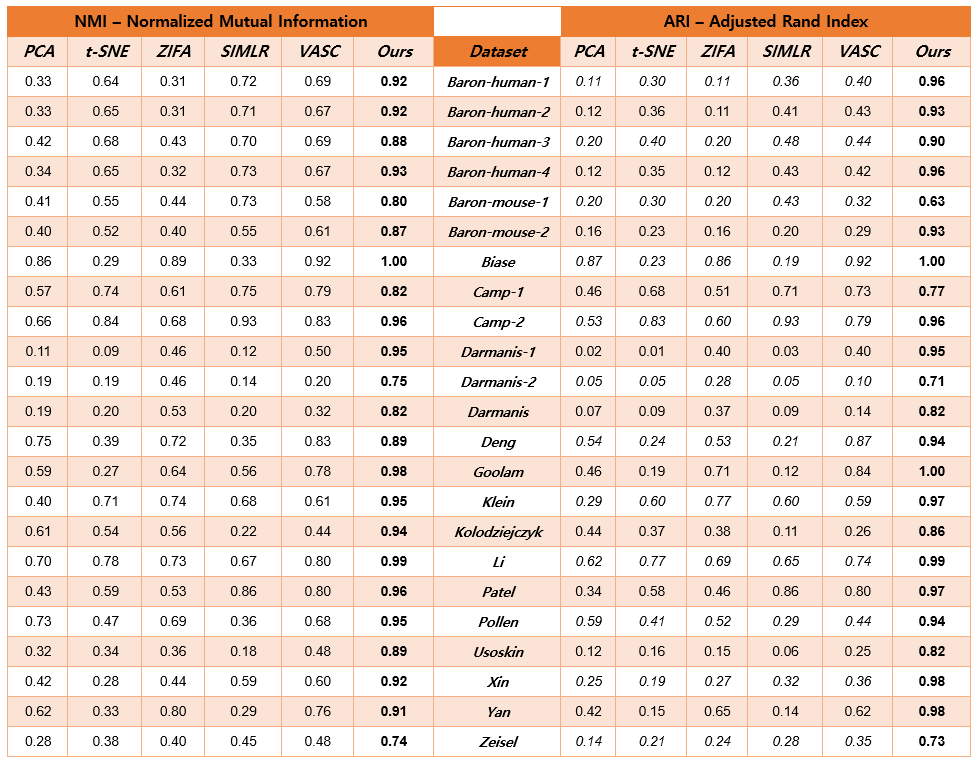

#  foreSC: deep learning embedded framework for single-cell data analysis 
## *** Dimension Reduction, Visualization and Classification ***
-----------------------------------------------------------------------------------------------------------------------------------------------------------
 
### Batch effect correction

* It is a very interesting finding that we can help address the batch effect very well. The below figure illustrates the good performance of batch effect correction of we in 7 cell lines dataset (A549-hungman lung carcinoma cell lines, H1437-lung metastatic, HCT116-colorectal carcinoma, IMR90-human Caucasian foetal lung fibroblast, K562-human Caucasian chronic myelogenous Leukemia, GM12878-B-Lymphocyte, H1-embryonic stem cell). 

 

### Dimension Reduction & Visualization
 

* The table shows the updated comparison of performance between our method and other recent state-of-the-art methods. To illustrate the good performance of our method in dimensional reduction and visualization against previous methods, we tested the clustering performance of 2-D presentation of 23 datasets with a variety of ranges of number of cells and types. Each dataset has specific different characteristics about sizes (number of cells, number of genes), number of cell types and sparsity. The 5 state-of-the-art methods of interest are principal component analysis (PCA), t-distributed stochastic neighbor embedding (t-SNE), zero-inflated factor analysis (ZIFA), single-cell interpretation via multi-kernel learning (SIMLR), and deep variational autoencoder for single-cell RNA-seq (VASC). The full clustering performance of selected methods over 23 datasets is shown in the table with two metrics: normalized mutual information (NMI) and adjusted rand index (ARI). The results show that our method can significantly improve the clustering performance and consequently the visualization performance. 

 
